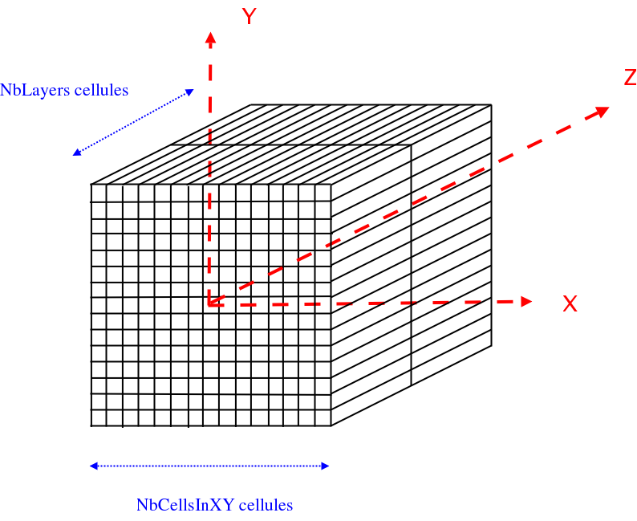

# Calorimeter description

Calorimeters are detectors used to measure energies of particles (except muons and neutrinos). To perform this, they stop completely the incoming particle and measure the deposited energy.

A photon, electron or hadron meeting a significant amount of material will interact with the material and will create showers of particles which are progressively stopped and which deposit their energy. The shape of the shower depends on the particle type and on its energy.

It is important to measure as much as possible the energy and the position of each particle in a given event. It is also important to measure the shape of the showers in order to identify the particle type. To do this, calorimeters are split into cells in which energy deposits are measured individually.

For this project, it is proposed to perform a simplified simulation of showers of electrons in a calorimeter, and to develop an algorithm to reconstruct the position of the impact point of the electron at the front surface of the calorimeter from the energies deposited in the cells. Real calorimeters as the ones found in particle physics experiments, are too complex to be implemented for this project. Therefore, we will simulate a simplified calorimeter, made of one rectangle of material splitted into cells, as illustrated below:

 The front face of the calorimeter is in the (X,Y) plane and extends from XYMin to XYMax. It is segmented along the 2 axis into NbCellsInXY cells. The depth of the calorimeter extends from Z=0 to Z=Zmax and is divided into NbLayers layers. As a first step, only one layer will be considered. It is however important to consider as early as possible that the calorimeter can be segmented into more than one layer.

Units are meter and GeV.
