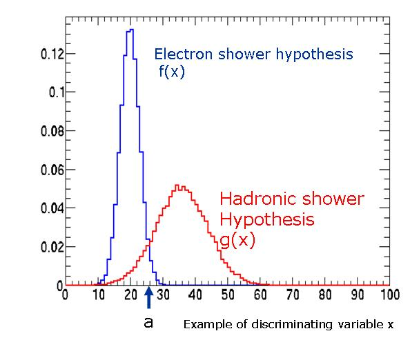

# Calorimeter discrimination

## Longitudinal granularity

In this section, the calorimeter have 10 longitudinal layers. Change accordingly the file `CalorimeterConstants.h`. Make sure that the results are fine.

## Hadronic shower simulation

It is more difficult to simulate hadronic showers so a simplified model will be used. An hadronic shower contains an electromagnetic component (from neutral pions) and a hadronic component. The fraction of the hadronic component is given by the parameter f (0<f<1):
```
hadronic shower = (1-f)*electromagnetic component + f*hadronic component.
```
For each simulated shower, the parameter f is drawn randomly and uniformly in the range [0,1].

Create a function `SimulateHadShower()` in `CaloSimulation.*` in order to simulate hadronic showers. For the two components of the hadronic showers the same parameterisation as the previous section (Gaussian for the lateral shape and gamma function for the longitunal shape) is used but with different parameter values:

|    | electromagnetic | purely hadronic  |
| -- | --------------- | ---------------- |
| R  | 5 cm            | 10 cm            |
| a  | 4               | 2                |
| b  | 0.5             | 1                |
| X0 | 0.01            | -                |
| L  | -               | 0.1              |
| t  | z/X0            | z/L              |


- Make sure when you combine the two components that the normalisation for each component is 1. In particular, for the gamma function, you can use `TMath::GammaDist(t,a,0.,1./b)`.
- Make sure that for `f=0`, `SimulateHadShower()` and `SimulateShower()` give the same results.

## Efficiency/Rejection

Thanks to the simulation code, find variables (at least 2) which are different for electron showers and hadronic showers. Compare the distributions of these discrimating variables, check the correlation between the different variables,...

A dummy example of a discriminating variable can be found below:



In this example, one can select a sample enriched with real electrons by selecting showers with `x < a`. The efficiency of such cut is defined as:


The rejection of such cut is defined as:


For each discrimating variable compute the efficiency and the rejection for different set of cuts.

## Variable combination

Variables can be combined in order to improve the discriminating power of each variables. Several methods exists (Fisher discriminant, Neural Network, Likelihood ratio,...). The latest is optimal when the variables used are uncorrelated and will be used here.

The first step is to obtain an analytic parameterisation of each distribution by fitting them with an appropriate function using root for each hypothesis: `fi` for the electron showers and `gi` for hadronic showers. The likelihood for the electron hypothesis is given by `Le(x1,...,xn) = Πi fi(xi)` and similarly for the hadronic showers: `Lp(x1,...,xn) = Πi gi(xi)`. For a given event, a likelihoon ratio can be computed:
```
xe(x1,...,xn)=Le(x1,...,xn)/(Le(x1,...,xn)+ Lh(x1,...,xn) )
```
- From the two previously parametrized variables, build this new variable and study its rejection.
- Other variables can be searched for and added to study if they improve the result. 

