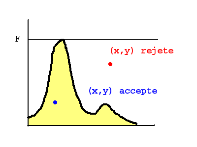
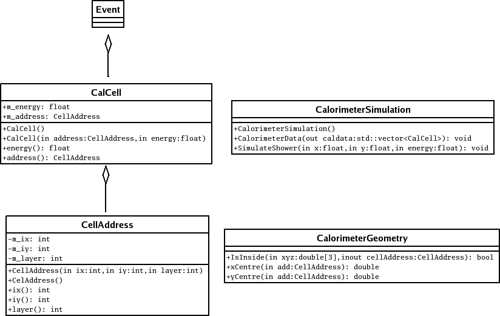

# Simulation

## Fast and slow simulation

Most of the experiments in particle physics employ the GEANT software to simulate particles interacting in their detector. GEANT simulates step by step the interactions between the particles and the matter and the energy deposits. This yields a fine and detailed picture of the event and allows to simulate accurately the detector response. The counterpart of this accurate method is its slowness. It can take up to several minutes per event, while millions of events have to be simulated.

It is often useful and sometimes it is sufficient to employ a fast simulation of the detector response (eg. in ATLAS experiment at LHC see ATLFAST). This is what we propose to do now: simulate the energy deposits of an electron in a calorimeter, using a simple parametrisation of the electromagnetic shower shapes.

## Introduction to Monte Carlo methods

In the simulation, we have to generate energy deposits in the three dimension space following a pre-defined electromagnetic shower shape and accumulating an energy deposit in each of the calorimeter cells. The Monte Carlo method is well suited to generate random numbers according to any kind of distribution.

Let a function f(x) defined in the range [0, 1] and positive. The maximum of f(x) is F. If we draw randomly according to a uniform distribution between 0 and 1 pairs of numbers (x,y) and if we keep only the pairs for which y< f(x)/F, then the series of values (x1,..,xN) we obtained has the property of being distributed according to the probability density function f(x). This method can be generalized easily for multi-dimension functions f(x,y,z,...). An illustration for this algorithm is given below.



The efficiency of the method can be defined as the fraction of random draft that we keep to obtain the right distribution. The efficiency is all the more high that f is close to a uniform distribution. In contrary, using this method to generate numbers according to a distributions with pronounced peaks is not efficient. In the same manner, if the distributions shows narrow structures, a lot of random drafts are needed to make them visible. For both cases, it is sometimes possible to decide a variable change that yields a smoother distribution. Another possibility consists in generating numbers in a piecewise way.

## Excercise: random generation according to a Gaussian law

We are going to use ROOT to check and validate the result. The purpose of this example consists in drawing randomly a few numbers according to a gaussian law in the range [-2,2]. To this end, create a file called `genGauss.C` following the model shown below:

```
#include "TH1F.h" 
#include "TRandom.h" 

void genGauss()
{
    TH1F* h = new TH1F("hGauss", "Gaussian distribution", 100, -2., 2.);

    // Draw 10000 numbers according the gaussian law 
    // We use gRandom->Uniform(MAX)  to draw numbers 
    // uniformly  between  0. and MAX 
    for (int i=0; i<10000; i++) {
        float x = 0.; 
        // put here your piece of code

        // we  fill here the histogram 
        h->Fill(x); 
    } 
}
```

- Complete the file using the Monte Carlo algorithm.
- To check the results, fit the histogram with a Gaussian function. The ROOT commands for this are: 

```
.L genGauss.C
genGauss() 
hGauss->Draw() 
hGauss->Fit("gaus")
```

- ROOT is also able to directly generate a gaussian distribution with the function `gRandom->Gaus()`. Use it and compare the result with the histograms from the Monte Carlo method.
- How can you use the Monte-Carlo technics to compute the area under the Gaussian for `|x| > 3*sigma`?

## Representing the calorimeter

The calorimeter and its simulation will be represented using several classes as shown in this figure:



 The various classes are represented above using the UML convention. For each class, the upper frame indicates the name of the class, in the middle frame the various class members are quoted and in the lower frame the class functions are enumerated. In the figure above the different classes have been simplified. In particular the Event class is not detailed. The CellAddress and CaloCell classes represent the cells of the calorimeter. The CaloGeometry class gathers various utility functions and most of the simulation is implemented in the CaloSimulation class.

A file named `CalorimeterConstants.h` is already included in the project. This file contains the various constants that define the calorimeter geometry. Employ those pre-defined variables each time it is necessary in your code. If you do so, varying the calorimeter features and geometry will simply consists in modifying solely this file.

Each cell of the calorimeter is identified by its "address" that is related to its actual position along the (X,Y and Z) axis and also contains the piece of information related to the energy deposit. The address is reprensented by the CellAddress class, whose template is already included in the file `CellAddress.h`.

- NB1: The CellAddress class overloads the `<` and `>` operators that define an order relation between the CellAddress and also the `<<` operator that enables to print directly an object of type CellAddress.
- NB2: For a real application, it may be important to limit the size of the data in memory. Here, we have chosen three int (ix, iy, layer) to build an address. In many cases, it could be possible to compact this piece of information. If we use a class, we hide this kind of implementation detail and it can be modified later on without changing the classes that use CellAddress. Just recompiling the code will be enough to propagate the modification. 
- Write the corresponding `CellAddress.cxx` file.
- Check that the implementation of CellAddress is correct. To do so, add some lines in your `main()` function in `MainEvent.cxx`. For example you can try to make a print out of the one of the coordinates of a cell. 

The calorimeter cell and its energy are represented by the CaloCell class, which template is given in `CaloCell.h`.

- Write the corresponding file `CallCell.cxx` as well as a small test program that calls the various constructors and class methods. 

Finally, we have chosen to gather the various utility function related to the calorimeter geometry in a single class called CaloGeometry. The functions are defined in `CaloGeometry.h` but still need to be implemented.

- Write the corresponding `CaloGeometry.cxx` file as well as a small test program that calls the various constructors and class methods. 

## The map<>

In the standard template library, map allows to match a key of type K to a value of type V for more details and useful links). This is a kind of dictionary that allows to look for a value from a key. The class K must have been defined with methods allowing comparisons between objects of type K.

Here is an example showing the usage and feature of map<>

```
#include <iostream> 
#include <map> 
#include <string> 
#include <cassert>

typedef std::map<std::string,int> Scores;

void update(Scores& scores, std::string pseudo, int score)
{
    Scores::iterator pos = scores.find(pseudo);
    if ( pos == scores.end() ) { // not found.This is a newcomer 
        scores[pseudo]=score;
        std::cout << "Welcome " << pseudo << " !" << std::endl; 
    }
    else { 
        // the iterator pos points to a pair<>, which elements are 
        // "first" and "second"
        if ( pos->second < score ) {
            pos->second = score;
            std::cout << " Congratulation " << pos->first << ", you just increased your score with " << pos->second << " points !!!! " << std::endl;
        }
        else std::cout << "Too bad, " << pos->first << ", try to do better next time! " << std::endl;
    }
}

int main () // Simulation of a high score list 
{
    Scores scores;
    //  scores at beginning
    std::string pseudos[] = { "Alpha", "BigJoe", "Lara" };
    int hi[] = { 207352, 87623, 307239 }; 
    assert( sizeof(pseudos) / sizeof (std::string) == sizeof(hi) / sizeof(int) ); 

    for (int i = 0; i < sizeof(pseudos) / sizeof(std::string); i++)
        scores[pseudos[i]] = hi[i];

    update(scores,"Lara",76430); // Lara just obtained 76430
    update(scores,"toto",2673); // "toto" just obtained 2673 :-( 

    return 0;
}
```

A `map<>` is the recommended solution to implement the calorimeter simulation. CellAddress can be used as a key (this is possible because comparison operator `< and >` have been defined for CellAddress).

## The calorimeter simulation

It is assumed that electrons arrives perpendicularly through the front end of the calorimeter. Parametrisations of electromagnetic showers are proposed in the Particle Physics Booklet ( see the online version of chapter 1).

We choose to parameterize the longitudinal development of the shower with:
```
dE/dt ~ (bt)a-1e-bt
```
where t=z/X0, X0 being the radiation length. We choose X0 to be 1cm, a=4 and b=0.5. The maximum of the function is reached for t=(a-1)/b. For the transverse development, we choose to use simply a gaussian of width MR=5cm (Moliere Radius).

The simulation occurs in the CaloSimulation class, which template is included in CaloSimulation.h. Write the simulation of the electromagnetic shower in the method `SimulateShower()`: generate the energy deposit according the the shower parametrisation defined above and accumulate the energy deposit in the corresponding calorimeter cells. To this end, you will make the most of your knowledge of the Monte Carlo method. You will also need to employ the functionality of the CaloGeometry class.

Afterwards, write the `simulate()` function (called from the main() function), that is supposed to:

- fill the energy of a real electron (you will take the electron energy as being a fixed value of 50 GeV in a first step)
- draw randomly the position of the impact point on the front end of the calorimeter
- employ CaloSimulation to simulate the energy deposits. Modify the Event class to store the impact position and the calorimeter cells. 

To test visually the simulation, it is interesting to employ histograms. For this, modify the `ana_simu()` function which is called just after `simulate()` in the `main()` function. In this function, you can create and fill histograms to check the simulation. For example, it may be interesting to create an histogram with the position of the cells weighted by their energy. If you simulate only one or two events, this histogram will display the shape of the simulated shower shapes.

## The calorimeter response

The energy deposited in the calorimeter cells is read afterwards by electronic devices that allows to handle the information for each event.

The energy can be measured because the particles from the shower ionize the matter of the calorimeter (such as noble liquids), the electric charge resulting from the ionization is proportional to the energy. Another sort of calorimeter is based on scintillating matters that emits light when the particles from the showers go through it. The light yield is measured to reconstruct the shower energy.

The energy measurement in a calorimeter is not perfect. The uncertainty on the measurement (the calorimeter resolution) can generally be described by the formula: σE/E = a/√ E ⊕ b ⊕ c/E

The first term represents the statistical fluctuation of the shower. Indeed in the simulation of the shower development you have simulated the average behavior of the calorimeter. But in real life, even if you start with identical incoming electrons you will have different showers because of fluctuations in the number of particles emitted during the showering. As the number of particles is large it follows a Gaussian law of width √N, where N is the average number of particles in the shower.

- N being proportional to the energy of the incoming particle, compute the reconstructed energy so that it follows a Gaussian distribution of width σ = 10% (√E/√E0) where E0=1 GeV and of mean value the true energy. This reconstructed energy will be employed to calculate the energy deposit in the cells. 

The other terms of the calorimeter simulation, b and c, are due to inhomogeneities of the calorimeter and to the electronic noise. These terms are smaller that the stochastic term a and they will be neglected for this simulation. 
